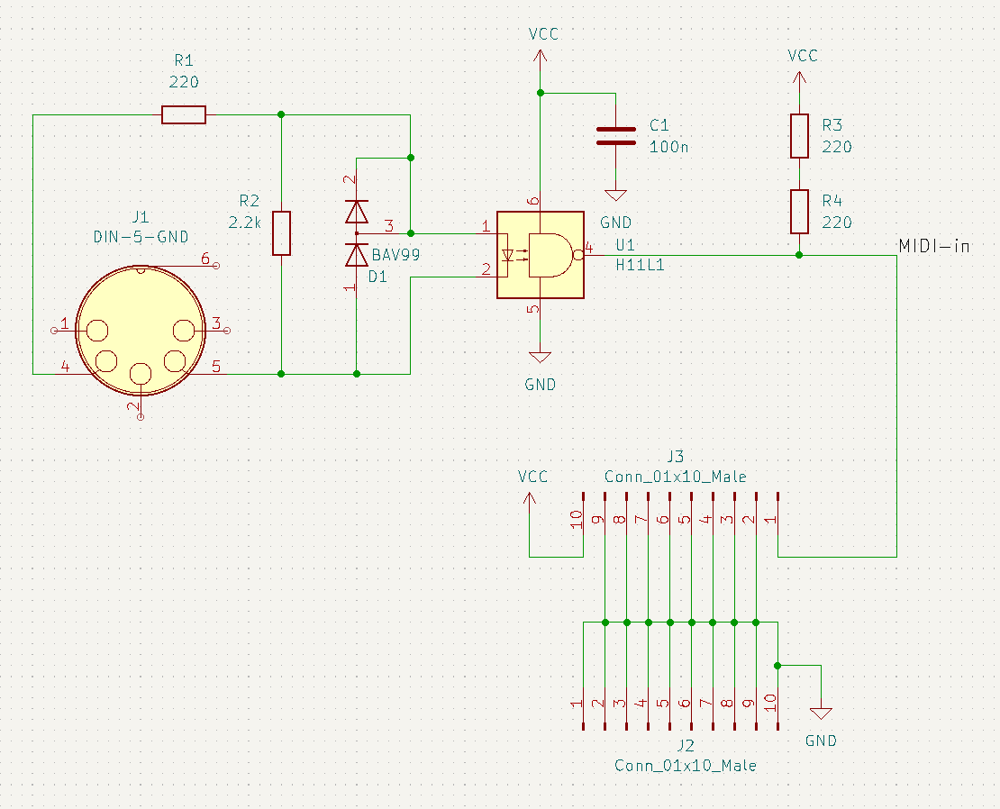
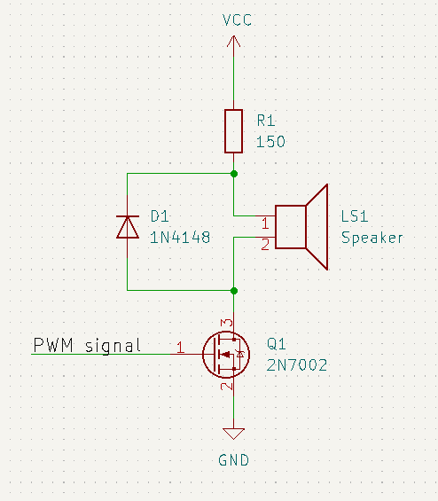

# MIDI synthesizer

This is the MIDI synthesizer project for the [RISC-V Design Challenge](https://www.hackster.io/contests/hackitriscv). I'm using [this board](https://lcsc.com/product-detail/Development-Boards-Kits_WCH-Jiangsu-Qin-Heng-CH32V307V-EVT-R1_C2943980.html) for it.

The board is configured to receive the MIDI data with an opto-isolator with the standard MIDI frequency of 31,250 Hz. The firmware then detects note-on and note-off events and generates a PWM signal with the requested pitch.

Soldering the MIDI-in board and testing the project:

https://www.youtube.com/watch?v=y-bby_u5XV8

## Software

First install MounRiver, as described here:
https://www.youtube.com/watch?v=JHzsH9RhTR4

Then download or clone this repository and open the project file `midi-synthesizer.wvproj` in the `midi-synthesizer` directory. You can then build and upload it.

## Hardware

Circuit diagram of the MIDI-in board:

You can find the KiCad project in the `midi-in-module` directory. There is also a `gerbers.zip` file, which you can use to order your board from a PCB manufacturer like https://jlcpcb.com.

Parts list, which you can get from https://www.digikey.com:

| Id | Designator | Package | Quantity | Designation | Digi-Key Part Number |
| -- | -- | -- | -- | -- | -- |
| 1 | D1 | SOT-23 | 1 | BAV99 | 3191-BAV99CT-ND |
| 2 | R1,R3,R4 | R_1206_3216Metric | 3 | 220 | 311-220ERCT-ND |
| 3 | J3,J2 | PinHeader_1x10_P2.54mm_Vertical | 2 | Conn_01x10_Male | Z12462-ND |
| 4 | J1 | DIN_CUI_SD-50BV | 1 | DIN-5-GND | CP-3150-ND |
| 5 | C1 | C_0805_2012Metric | 1 | 100n | 478-1395-1-ND |
| 6 | R2 | R_0805_2012Metric | 1 | 2.2k | 311-2.20KLRCT-ND |
| 7 | U1 | DIP-6_W8.89mm_SMDSocket_LongPads | 1 | H11L1 | H11L1SMCT-ND |

When soldering it, you can use (this interactive placement tool)[midi-in-module/bom/ibom.html] to find the location of the components.

You can connect the PWM output directly to a high impedance amplifier, or you can build a simple amplifier with a N-channel MOSFET to drive a speaker, as seen in the video:

## Connections

On the dev board, connect PA0 to LED1, to light the LED when a note is playing. Connections to the MIDI-in board:

| dev board | MIDI-in board |
| -- | -- |
| VCC | +5V |
| GND | GND |
| PA10 | MIDI-in |

Note: VCC is 3.3V. The MIDI-in board works with 5V and 3.3V.

Then connect PA8 to an audio amplifier, connect a MIDI keyboard, or a USB-to-MIDI interface as seen in the video.

## Credits

The MIDI demo file is from https://www.free-scores.com/download-sheet-music.php?pdf=11596#.
